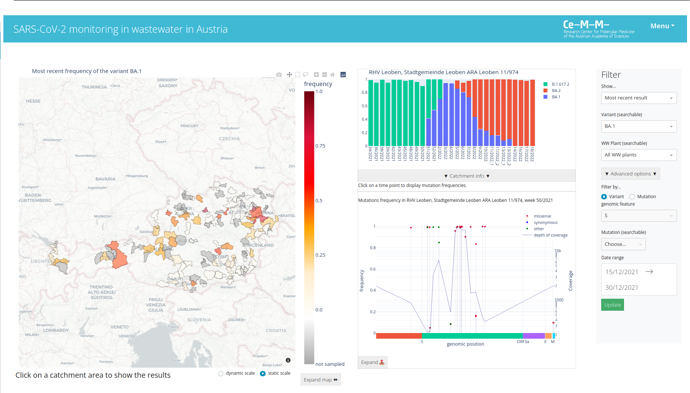

# WAVES (Web-based tool for Analysis and Visualization of Environmental Samples)
## A web application for visualization of wastewater pathogen sequencing results

This web-based application enables interactive visualization and analysis of SARS-CoV-2 sequencing data from wastewater treatment plants.
The application can be easily customized through the configuration file. For customization of the configuration file you will need a geojson file containing shape of your
catchment areas, a csv file containing basic information about catchment areas and sequencing data in the csv table.
The software is written in python 3.8 and the web server runs on Plotly Dash.

## Quickstart
+ git clone https://github.com/ptriska/WavesDash
+ cd WavesDash
+ pip install -r requirements
+ python app.py
+ open browser at localhost:8050

## Production deployment with Docker
#### Using image from Docker hub
+ docker pull wasa000/waves
+ docker run -p 8050:8050 wasa000/waves
#### Provide own config file and data
+docker run -p 8050:8050 --mount type=bind,source=/[path to your config file at local machine]/config.py,target=/home/WavesDash/config.py -v [path to the data folder]/data/:/home/WavesDash/data/ wasa000/waves

## Example
Demo verison of the application:
https://wavesdashboard.azurewebsites.net/

## Customization of the app
+ customize the config.py
+ supply own data files (example data files are in data/)
+ input data file format is described in file_format.txt
+ supply own geojson file with sampling areas
+ supply own description of sampling locations (sampling_locations.tsv)

## Input data file formats

### variant data file (data/variant_freq.tsv, tab-delimited)
*columns:*
+ variant (string) name of the variant (e.g. BA.1)
+ LocationID (string) ID of the sampling area
+ LocationName (string) plain text name of the sampling area
+ sample_id (string) ID of the sample
+ sample_date (string, YYYY-MM-DD) sampling date
+ value (float between 0 and 1) frequency of detected variant in the sample

### allele data (data/allele_freq.tsv, tab-delimited)
*columns:*
+ sample_id (string) must correspond to the Sample_ID in the variant frequency file
+ position (integer) position in the genome
+ chrom (string) genomic feature ID (reference seq ID)
+ ref (string) reference allele
+ alt (string) alternative allele
+ ann_effect (["missense_variant","synonymous variant"]) effect of the mutation
+ ann_aa (string) amino acid change caused by the mutation
+ allele_freq (float between 0 and 1) frequency of the allele in the sample
+ depth (integer) optional; depth of sequencing at the position of the allele
